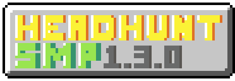

# 

In this SMP, everyone has 10 heads. Lose them all to a player, and you are gone! There is no way to get unbanned, unless a friend makes an unban anchor for you.

# 

## config.yml File
````yaml
##### NOTES #####
#  The term 'Enable the option' indicates setting the option's value to 'true'.
#  The term 'Disable the option' indicates setting the option's value to 'false'.

# Default head count that every player will get on first join and unbans.
default-heads: 10

# Options about 'Extra Head' item.
extra-head:

  # Enables/Disables the recipe.
  enabled: false

  # If you somehow messed up the custom recipe options below, or you don't want a custom recipe, enable this.
  default-recipe: true

  # Shape of the recipe. Should have 3 rows with only 3 letters. Every letter should be attached to a Material at the 'materials' option below.
  shape:
    - 'DSD'
    - 'CNR'
    - 'DZD'

  # Material attachments for the recipe. all keys should be one letter, and values should be a valid Material.
  # See https://hub.spigotmc.org/javadocs/bukkit/org/bukkit/Material.html for every valid Material.
  # WARNING: This plugin is supposed to run at 1.19.X, you shouldn't use any newer materials at the recipe.
  materials:
    D: 'DIAMOND_BLOCK'
    S: 'SKELETON_SKULL'
    N: 'NETHER_STAR'
    R: 'DRAGON_HEAD'
    Z: 'ZOMBIE_HEAD'
    C: 'CREEPER_HEAD'

  # Display name of the 'Extra Head' item.
  name: '&eExtra Head'

  # Description about the 'Extra Head' item.
  description: '&6Right click to gain one extra head!'

# Options about 'Unban Anchor' item.
unban-anchor:

  # Enables/Disables the recipe.
  enabled: true

  # If you somehow messed up the custom recipe options below, or you don't want a custom recipe, enable this.
  default-recipe: true

  # Shape of the recipe. Should have 3 rows with only 3 letters. Every letter should be attached to a Material at the 'materials' option below.
  shape:
    - 'OOO'
    - 'PPP'
    - 'OOO'

  # Material attachments for the recipe. all keys should be one letter, and values should be a valid Material.
  # See https://hub.spigotmc.org/javadocs/bukkit/org/bukkit/Material.html for every valid Material.
  # WARNING: This plugin is supposed to run at 1.19.X, you shouldn't use any newer materials at the recipe.
  materials:
    O: 'OBSIDIAN'
    P: 'PLAYER_HEAD'

  # Display name of the 'Unban Anchor' item.
  name: '&dUnban Anchor'

  # Description about the 'Unban Anchor' item.
  description: '&5Place this somewhere to unban a player!'

# Message options
messages:

  # Players will see this when they got killed by a player, meaning they lost a head.
  # %count% - New count of how may heads this player have.
  left-heads: '&aYou have &2%count% &aheads left.'

  # Players will see this when they got banned from the server because of losing all their heads.
  no-heads: '&cYou have no heads left.'

  # Player will see this when they get a head through picking up their own heads or consuming an 'Extra Head' item.
  new-heads: '&aAdded &2%added% &anew heads! You have &2%new% &aheads now.'

  # Options about 'Player Head' item. Which you can get via killing someone.
  head:

    # Display name of the item.
    name: '&ePlayer Head'

    # A description about who is the owner of this head.
    # %player% - Player that owns this head.
    own: '&6Belongs to &d%player%'

  # Options about 'Unban Anchor''s menu.
  unban:

    # Title of the menu. Does not support color codes.
    title: 'Choose a player to unban'

    # Display name of the close button (the barrier that sits on the bottom-center of the menu)
    close: '&cClose'
````